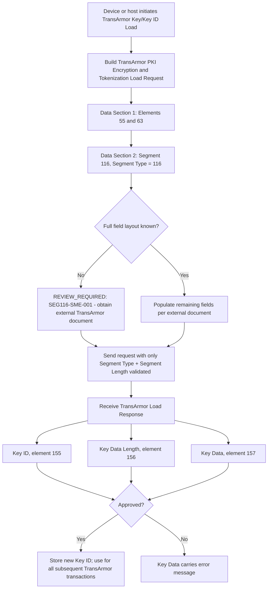

# Segment 116 End-to-End Flow

The `REVIEW_REQUIRED` branch is intentional. It prevents a syntactically valid Segment 116 fixture — built from only Segment Type and Segment Length — from being presented as proof of a complete, approved TransArmor Key/Key ID Load flow.
