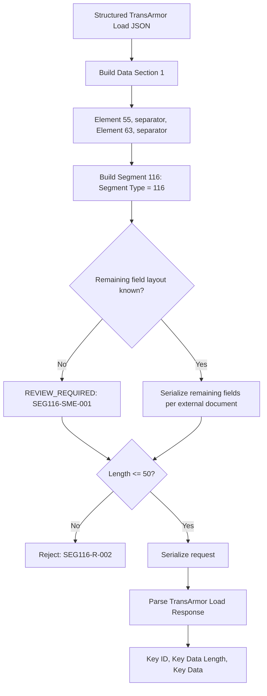

# Segment 116 Serialization and Wire-Format Flow

```mermaid
flowchart TD
    A[Structured TransArmor Load JSON] --> B[Build Data Section 1]
    B --> C[Element 55, separator, Element 63, separator]
    C --> D[Build Segment 116: Segment Type = 116]
    D --> E{Remaining field layout known?}
    E -->|No| F[REVIEW_REQUIRED: SEG116-SME-001]
    E -->|Yes| G[Serialize remaining fields per external document]
    F --> H{Length <= 50?}
    G --> H
    H -->|No| I[Reject: SEG116-R-002]
    H -->|Yes| J[Serialize request]
    J --> K[Parse TransArmor Load Response]
    K --> L[Key ID, Key Data Length, Key Data]
```
