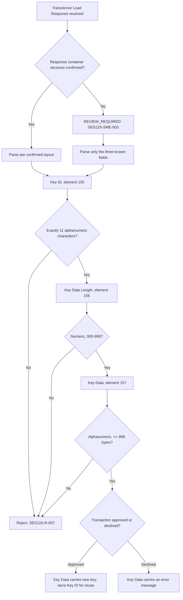

# TransArmor Load Response Decision Flow

```mermaid
flowchart TD
    A[TransArmor Load Response received] --> B{Response container structure confirmed?}
    B -->|No| C[REVIEW_REQUIRED: SEG116-SME-003]
    B -->|Yes| D[Parse per confirmed layout]
    C --> E[Parse only the three known fields]
    D --> F[Key ID, element 155]
    E --> F
    F --> G{Exactly 11 alphanumeric characters?}
    G -->|No| H[Reject: SEG116-R-007]
    G -->|Yes| I[Key Data Length, element 156]
    I --> J{Numeric, 000-999?}
    J -->|No| H
    J -->|Yes| K[Key Data, element 157]
    K --> L{Alphanumeric, <= 999 bytes?}
    L -->|No| H
    L -->|Yes| M{Transaction approved or declined?}
    M -->|Approved| N[Key Data carries new key; store Key ID for reuse]
    M -->|Declined| O[Key Data carries an error message]
```
