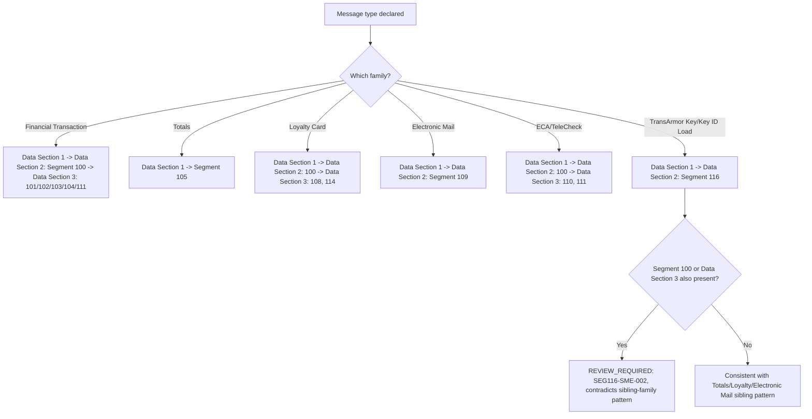

# TransArmor Request Envelope Lifecycle Decision Flow

This flow makes the analogy explicit: the Element 63 (Number of Segments) processing rule lists TransArmor alongside Totals, Loyalty Card, Electronic Mail, and ECA/TeleCheck as sibling message families, each with its own fixed Data Section 2 segment. Every sibling family except ECA/TeleCheck and Financial Transaction excludes Segment 100 and Data Section 3. TransArmor is grouped with the excluding siblings, but this has not been directly confirmed by a dedicated request table.
