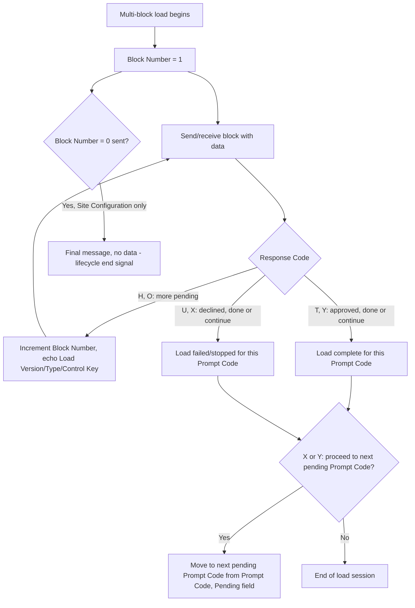

# Block Lifecycle and Multi-Message Loads Decision Flow

```mermaid
flowchart TD
    A[Multi-block load begins] --> B[Block Number = 1]
    B --> C[Send/receive block with data]
    C --> D{Response Code}
    D -->|H, O: more pending| E[Increment Block Number, echo Load Version/Type/Control Key]
    E --> C
    D -->|T, Y: approved, done or continue| F[Load complete for this Prompt Code]
    D -->|U, X: declined, done or continue| G[Load failed/stopped for this Prompt Code]
    F --> H{X or Y: proceed to next pending Prompt Code?}
    G --> H
    H -->|Yes| I[Move to next pending Prompt Code from Prompt Code, Pending field]
    H -->|No| J[End of load session]
    B --> K{Block Number = 0 sent?}
    K -->|Yes, Site Configuration only| L[Final message, no data - lifecycle end signal]
```
