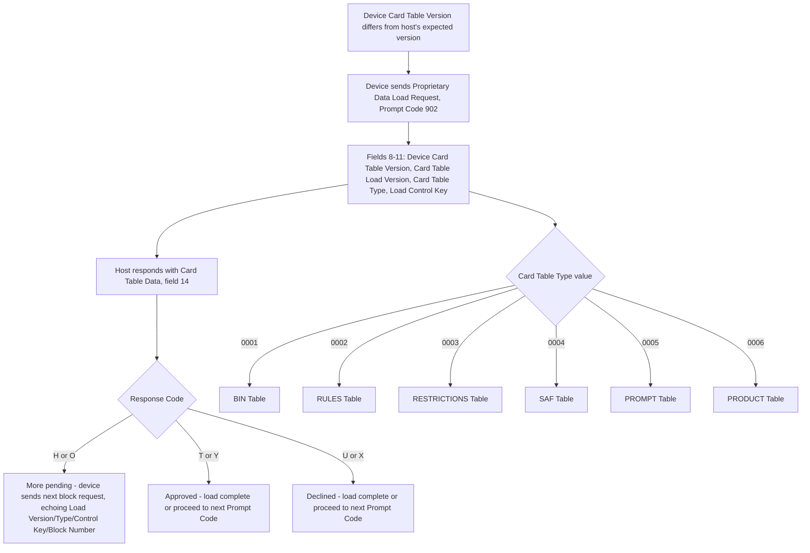

# Card Table Load (Prompt Code 902) Decision Flow

```mermaid
flowchart TD
    A[Device Card Table Version differs from host's expected version] --> B[Device sends Proprietary Data Load Request, Prompt Code 902]
    B --> C[Fields 8-11: Device Card Table Version, Card Table Load Version, Card Table Type, Load Control Key]
    C --> D[Host responds with Card Table Data, field 14]
    D --> E{Response Code}
    E -->|H or O| F[More pending - device sends next block request, echoing Load Version/Type/Control Key/Block Number]
    E -->|T or Y| G[Approved - load complete or proceed to next Prompt Code]
    E -->|U or X| H[Declined - load complete or proceed to next Prompt Code]
    C --> I{Card Table Type value}
    I -->|0001| J[BIN Table]
    I -->|0002| K[RULES Table]
    I -->|0003| L[RESTRICTIONS Table]
    I -->|0004| M[SAF Table]
    I -->|0005| N[PROMPT Table]
    I -->|0006| O[PRODUCT Table]
```
