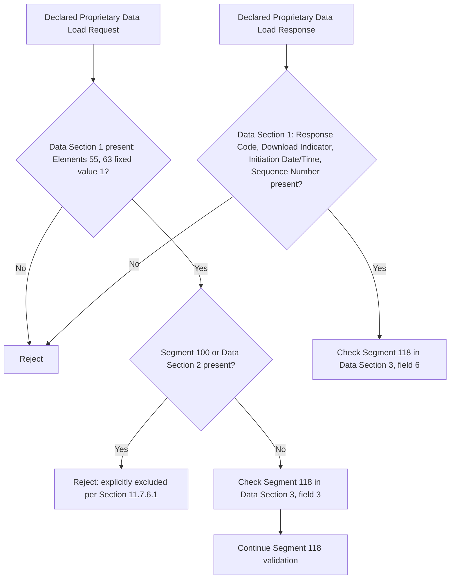

# Segment 118 Companion and Envelope Compatibility Flow

```mermaid
flowchart TD
    A[Declared Proprietary Data Load Request] --> B{Data Section 1 present: Elements 55, 63 fixed value 1?}
    B -->|No| C[Reject]
    B -->|Yes| D{Segment 100 or Data Section 2 present?}
    D -->|Yes| E[Reject: explicitly excluded per Section 11.7.6.1]
    D -->|No| F[Check Segment 118 in Data Section 3, field 3]
    F --> G[Continue Segment 118 validation]
    A2[Declared Proprietary Data Load Response] --> H{Data Section 1: Response Code, Download Indicator, Initiation Date/Time, Sequence Number present?}
    H -->|No| C
    H -->|Yes| I[Check Segment 118 in Data Section 3, field 6]
```
