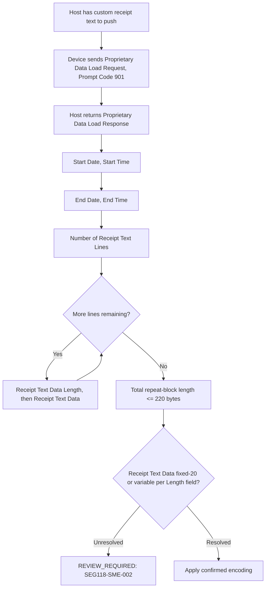

# Custom Receipt Text (Prompt Code 901) Decision Flow

```mermaid
flowchart TD
    A[Host has custom receipt text to push] --> B[Device sends Proprietary Data Load Request, Prompt Code 901]
    B --> C[Host returns Proprietary Data Load Response]
    C --> D[Start Date, Start Time]
    D --> E[End Date, End Time]
    E --> F[Number of Receipt Text Lines]
    F --> G{More lines remaining?}
    G -->|Yes| H[Receipt Text Data Length, then Receipt Text Data]
    H --> G
    G -->|No| I[Total repeat-block length <= 220 bytes]
    I --> J{Receipt Text Data fixed-20 or variable per Length field?}
    J -->|Unresolved| K[REVIEW_REQUIRED: SEG118-SME-002]
    J -->|Resolved| L[Apply confirmed encoding]
```
