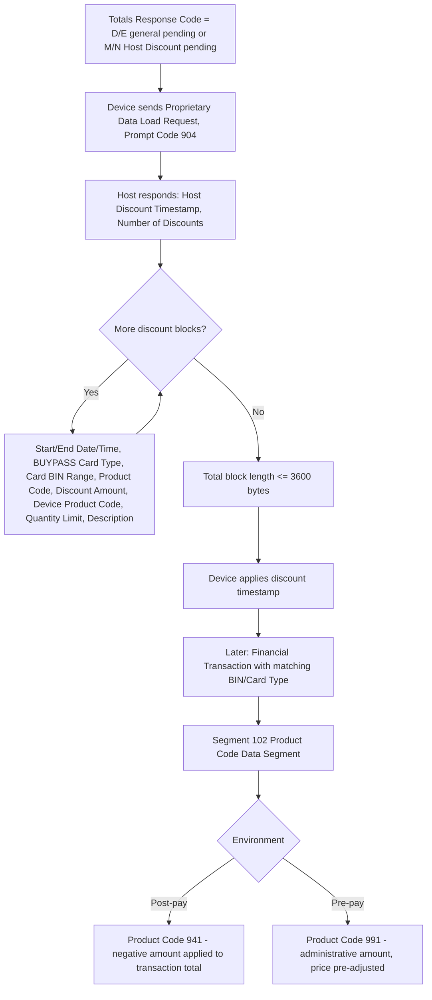

# Host Discount Data (Prompt Code 904) Decision Flow

```mermaid
flowchart TD
    A[Totals Response Code = D/E general pending or M/N Host Discount pending] --> B[Device sends Proprietary Data Load Request, Prompt Code 904]
    B --> C[Host responds: Host Discount Timestamp, Number of Discounts]
    C --> D{More discount blocks?}
    D -->|Yes| E[Start/End Date/Time, BUYPASS Card Type, Card BIN Range, Product Code, Discount Amount, Device Product Code, Quantity Limit, Description]
    E --> D
    D -->|No| F[Total block length <= 3600 bytes]
    F --> G[Device applies discount timestamp]
    G --> H[Later: Financial Transaction with matching BIN/Card Type]
    H --> I[Segment 102 Product Code Data Segment]
    I --> J{Environment}
    J -->|Post-pay| K[Product Code 941 - negative amount applied to transaction total]
    J -->|Pre-pay| L[Product Code 991 - administrative amount, price pre-adjusted]
```
