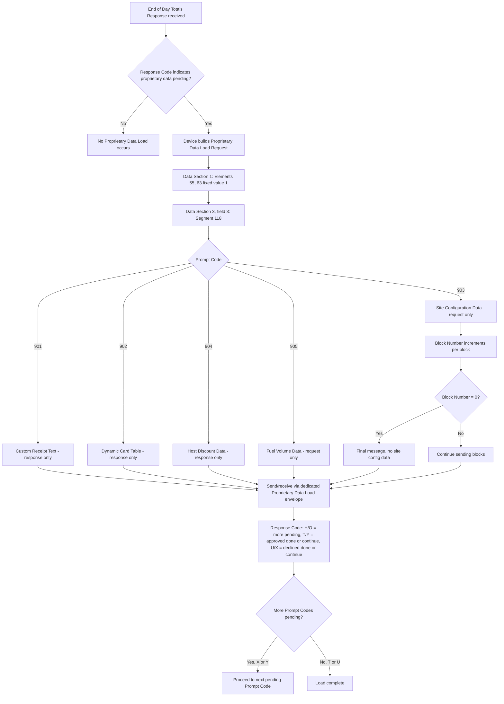

# Segment 118 End-to-End Flow

```mermaid
flowchart TD
    A[End of Day Totals Response received] --> B{Response Code indicates proprietary data pending?}
    B -->|No| C[No Proprietary Data Load occurs]
    B -->|Yes| D[Device builds Proprietary Data Load Request]
    D --> E[Data Section 1: Elements 55, 63 fixed value 1]
    E --> F[Data Section 3, field 3: Segment 118]
    F --> G{Prompt Code}
    G -->|901| H[Custom Receipt Text - response only]
    G -->|902| I[Dynamic Card Table - response only]
    G -->|903| J[Site Configuration Data - request only]
    G -->|904| K[Host Discount Data - response only]
    G -->|905| L[Fuel Volume Data - request only]
    J --> M[Block Number increments per block]
    M --> N{Block Number = 0?}
    N -->|Yes| O[Final message, no site config data]
    N -->|No| P[Continue sending blocks]
    H --> Q[Send/receive via dedicated Proprietary Data Load envelope]
    I --> Q
    K --> Q
    L --> Q
    O --> Q
    P --> Q
    Q --> R[Response Code: H/O = more pending, T/Y = approved done or continue, U/X = declined done or continue]
    R --> S{More Prompt Codes pending?}
    S -->|Yes, X or Y| T[Proceed to next pending Prompt Code]
    S -->|No, T or U| U[Load complete]
```
