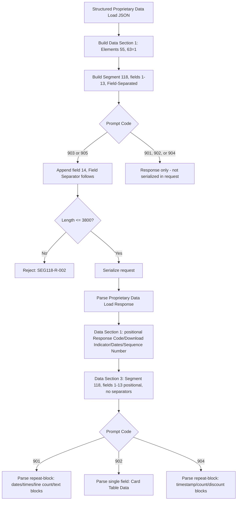

# Segment 118 Serialization and Wire-Format Flow

```mermaid
flowchart TD
    A[Structured Proprietary Data Load JSON] --> B[Build Data Section 1: Elements 55, 63=1]
    B --> C[Build Segment 118, fields 1-13, Field-Separated]
    C --> D{Prompt Code}
    D -->|903 or 905| E[Append field 14, Field Separator follows]
    D -->|901, 902, or 904| F[Response only - not serialized in request]
    E --> G{Length <= 3800?}
    G -->|No| H[Reject: SEG118-R-002]
    G -->|Yes| I[Serialize request]
    I --> J[Parse Proprietary Data Load Response]
    J --> K[Data Section 1: positional Response Code/Download Indicator/Dates/Sequence Number]
    K --> L[Data Section 3: Segment 118, fields 1-13 positional, no separators]
    L --> M{Prompt Code}
    M -->|901| N[Parse repeat-block: dates/times/line count/text blocks]
    M -->|902| O[Parse single field: Card Table Data]
    M -->|904| P[Parse repeat-block: timestamp/count/discount blocks]
```
