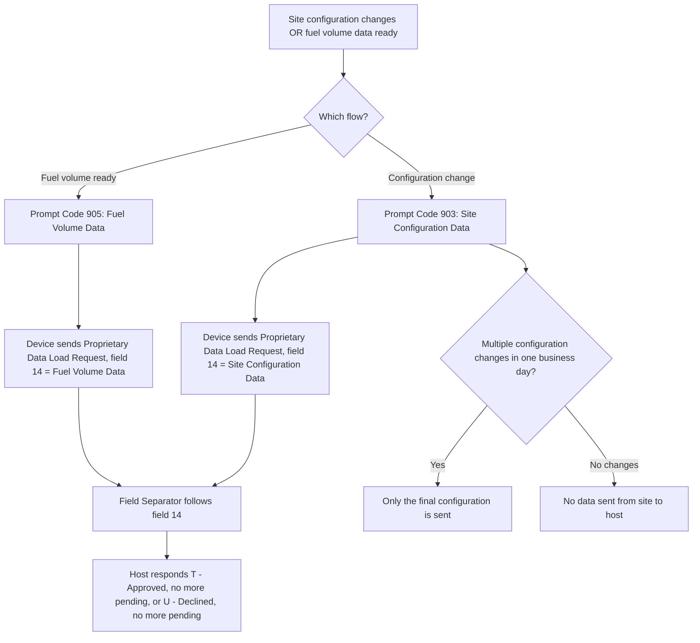

# Site Configuration and Fuel Volume (Prompt Codes 903/905) Decision Flow

```mermaid
flowchart TD
    A[Site configuration changes OR fuel volume data ready] --> B{Which flow?}
    B -->|Configuration change| C[Prompt Code 903: Site Configuration Data]
    B -->|Fuel volume ready| D[Prompt Code 905: Fuel Volume Data]
    C --> E[Device sends Proprietary Data Load Request, field 14 = Site Configuration Data]
    D --> F[Device sends Proprietary Data Load Request, field 14 = Fuel Volume Data]
    E --> G[Field Separator follows field 14]
    F --> G
    G --> H[Host responds T - Approved, no more pending, or U - Declined, no more pending]
    C --> I{Multiple configuration changes in one business day?}
    I -->|Yes| J[Only the final configuration is sent]
    I -->|No changes| K[No data sent from site to host]
```
