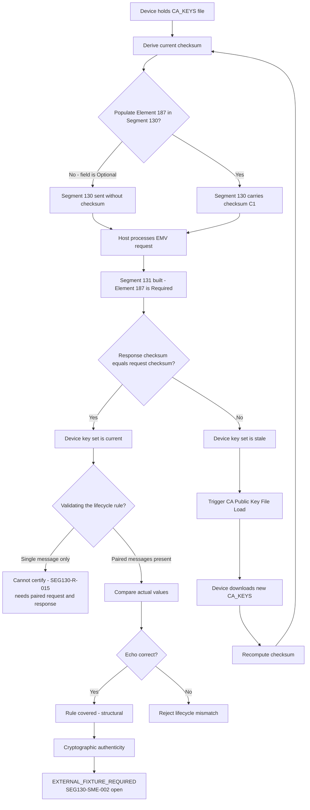

# CA Public Key File Checksum Lifecycle Flow



## Request vs Response Field Contract

```text
Segment 130 field 3  Element 187  Optional   <-- device may omit
        |
        v
Segment 131 field 3  Element 187  REQUIRED   <-- host must populate
```

The asymmetry is deliberate and is the reason a naive "present on both sides" assertion is wrong.

## Unresolved Gap

Sections 12.20 and 12.21 do **not** state what the host must echo when the request omits Element 187. Until `SEG130-SME-002` and this follow-up question are answered, that branch stays `REVIEW_REQUIRED`.
