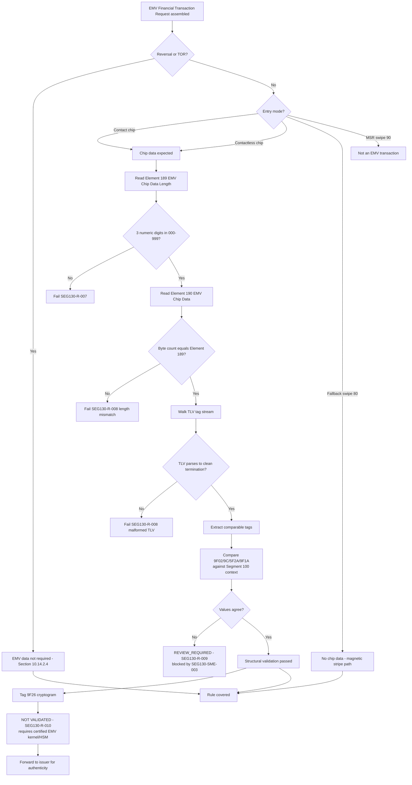

# EMV Chip Data and TLV Validation Flow



## Validation Boundary Summary

```text
+----------------------------------------------------------+
|  Validated by this framework                             |
|    - Element 189 format and range                        |
|    - Element 189 <-> Element 190 length agreement         |
|    - TLV framing / clean parse                            |
+----------------------------------------------------------+
|  Blocked pending SME input                                |
|    - Mandatory tag set per brand and transaction type     |
|    - Cross-field agreement with Segment 100 (SEG130-R-009)|
+----------------------------------------------------------+
|  Permanently out of scope                                 |
|    - Tag 9F26 cryptogram authenticity (SEG130-R-010)      |
|    - CA key resolution / checksum authenticity            |
+----------------------------------------------------------+
```

The essential point is that Element 190 is validated for **structure and internal consistency**, never for **cryptographic truth**. Any requirement that blurs that line is defective.
