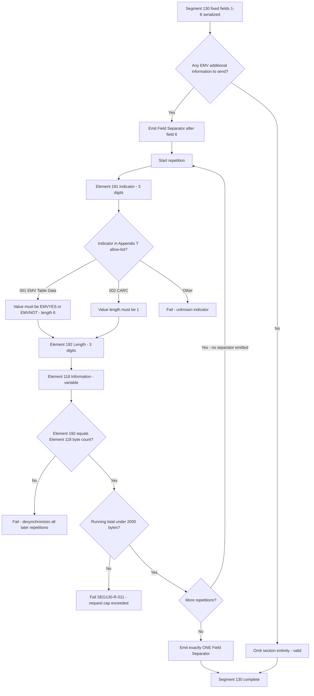

# EMV Additional Information Section Flow



## Appendix T Indicator Catalog

```text
Indicator 001  EMV Table Data
               len 6, values: EMVYES | EMVNOT
               request-side device capability flag
               if returned in a response, device echoes it on
               subsequent advice / batch upload requests

Indicator 002  Card Authentication Results Code (CARC)
               len 1
               value returned by Visa in Bit No. 44.8 of the response
               [SEG130-SME-007] request-side legality unconfirmed
```

## Separator Contract

```text
field 6 <FS> [191][192][118][191][192][118] <FS>
             \__________/ \__________/
              repetition 1  repetition 2
              no internal FS, no FS between repetitions,
              exactly one FS after the last one
```

## Length Cap Differs By Direction

```text
Segment 130 (request)  ->  2,000 bytes
Segment 131 (response) ->  2,800 bytes
```

Applying the request cap to responses produces false rejections.
