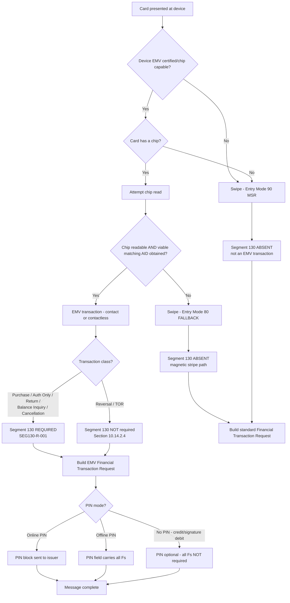

# EMV Entry Mode and Fallback Decision Flow



## Two Distinct Reasons Segment 130 May Be Absent

```text
+---------------------------+-------------------------------------------+
| Cause                     | Meaning                                   |
+---------------------------+-------------------------------------------+
| Entry mode 80 (fallback)  | Chip read failed / no viable AID.         |
| Entry mode 90 (MSR)       | Not an EMV transaction at all.            |
+---------------------------+-------------------------------------------+
| Reversal / TOR            | IS an EMV transaction, but Section        |
|                           | 10.14.2.4 waives the EMV data requirement.|
+---------------------------+-------------------------------------------+
```

These must produce **different** validator diagnostics. A single generic "Segment 130 missing" message is insufficient.

## Liability-Shift Trap

```text
chip card + chip-capable device + swipe
    -> MUST be entry mode 80
    -> sending 90 instead is structurally valid
       but forfeits liability-shift protection
```

This is a business defect that no syntax check will catch — it requires the device/card capability context to be present in the test data.
