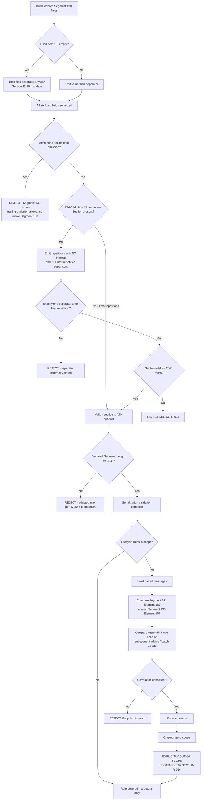

# Segment 130 Final Closure Flow



## Divergences From Segment 100 To Preserve

```text
Segment 100                          Segment 130
-----------                          -----------
trailing optional fields may be      no trailing-omission allowance;
omitted                              only the whole repeating section
                                     may be omitted

uniform separator rule               separator rule INVERTS inside the
                                     EMV Additional Information Section

lifecycle = original vs follow-up    lifecycle = request/response checksum
financial message                    echo PLUS Appendix T advice echo
```

Reusing the Segment 100 closure validator unmodified will produce both false accepts and false rejects.
