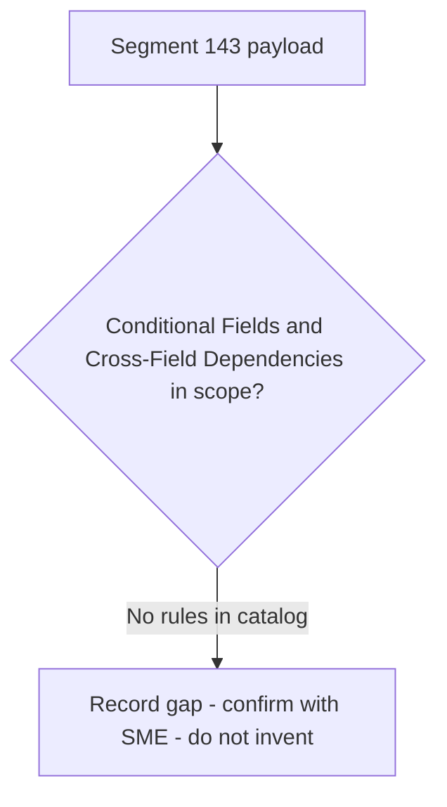

# Segment 143 Conditional Fields and Cross-Field Dependencies Flow

Rules are evaluated in catalog order. Provisional rules are shown with a dotted branch: they are documented but must not be certified as covered until the linked SME item is resolved.

Source: [segment-143-rule-catalog.json](coverage/segment-143-rule-catalog.json) · Note: [conditional-dependency-rules-sme-tba-note.md](conditional-dependency-rules-sme-tba-note.md)
