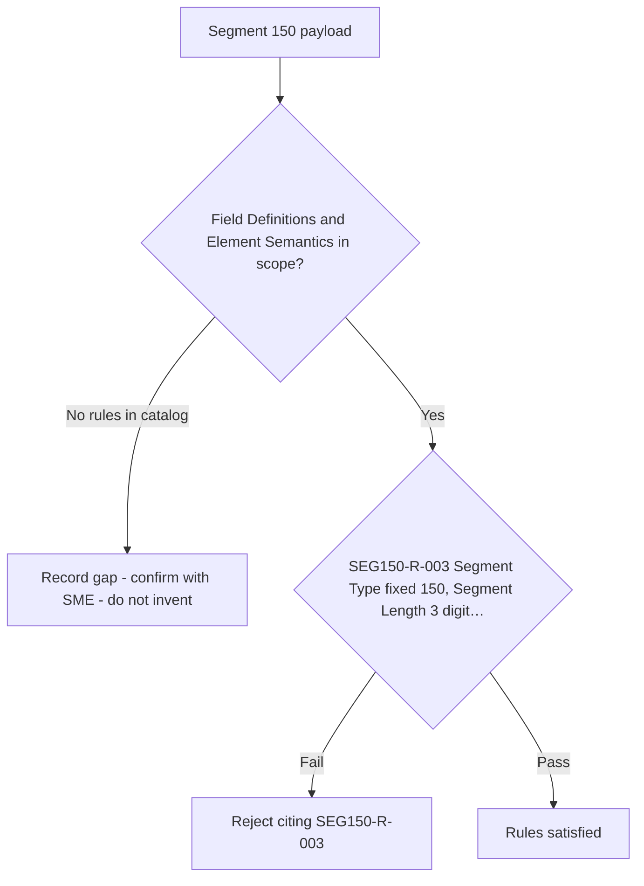

# Segment 150 Field Definitions and Element Semantics Flow

Rules are evaluated in catalog order. Provisional rules are shown with a dotted branch: they are documented but must not be certified as covered until the linked SME item is resolved.

Source: [segment-150-rule-catalog.json](coverage/segment-150-rule-catalog.json) · Note: [field-definitions-sme-tba-note.md](field-definitions-sme-tba-note.md)
