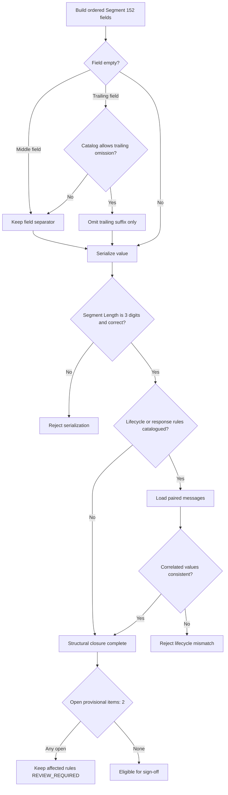

# Segment 152 Final Closure Flow

```mermaid
flowchart TD
    A[Build ordered Segment 152 fields] --> B{Field empty?}
    B -->|Middle field| C[Keep field separator]
    B -->|Trailing field| D{Catalog allows trailing omission?}
    D -->|Yes| E[Omit trailing suffix only]
    D -->|No| C
    C --> F
    E --> F
    B -->|No| F[Serialize value]
    F --> G{Segment Length is 3 digits and correct?}
    G -->|No| X1[Reject serialization]
    G -->|Yes| I
    I{Lifecycle or response rules catalogued?}
    I -->|No| Z[Structural closure complete]
    I -->|Yes| J[Load paired messages]
    J --> K{Correlated values consistent?}
    K -->|No| X2[Reject lifecycle mismatch]
    K -->|Yes| Z
    Z --> P{Open provisional items: 2}
    P -->|Any open| R[Keep affected rules REVIEW_REQUIRED]
    P -->|None| S[Eligible for sign-off]
```

Serialization rules: 1 · Lifecycle/response rules: 0 · Open provisional items: 2
