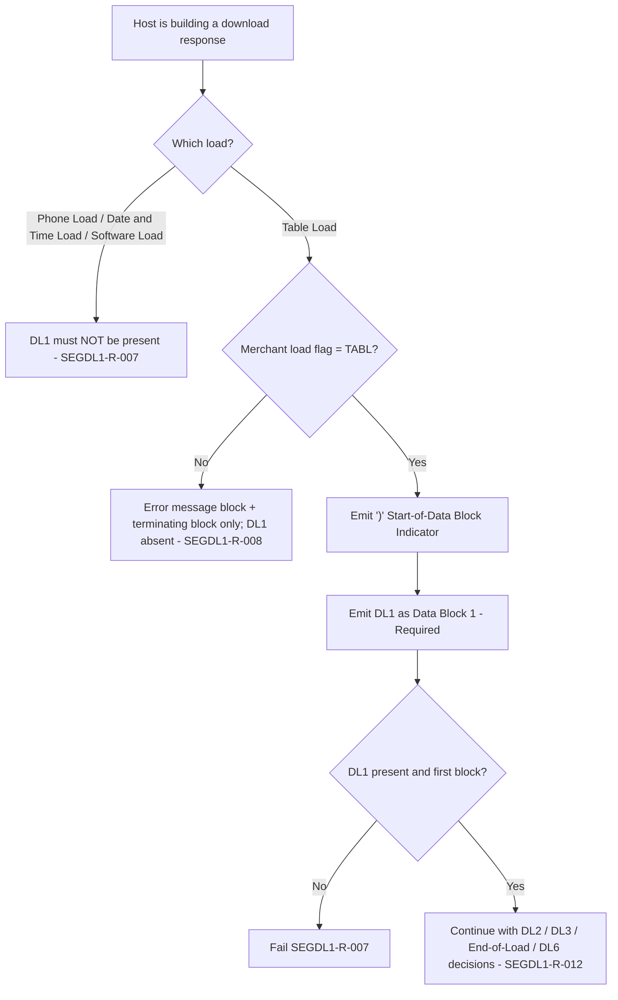

# Segment DL1 Applicability and Message-Family Decision Flow

| Message | DL1 | Evidence |
|---|---|---|
| Table Load Response (11.7.1.2) | **R**, Data Block 1 | Layout field 2; Chapter 12 matrix |
| Phone Load Response (11.7.2.2) | Not allowed | Layout lists DL2 only |
| Date and Time Load Response (11.7.3.2) | Not allowed | Layout lists DL3 fields only |
| Software Load Response (11.7.4.2) | Not allowed | Layout lists DL4 and DL5 only |
| Any request message | Not allowed | DL1 originates at BUYPASS |

Source: [segment-DL1-rule-catalog.json](coverage/segment-DL1-rule-catalog.json) · Note: [applicability-decision-sme-tba-note.md](applicability-decision-sme-tba-note.md)
