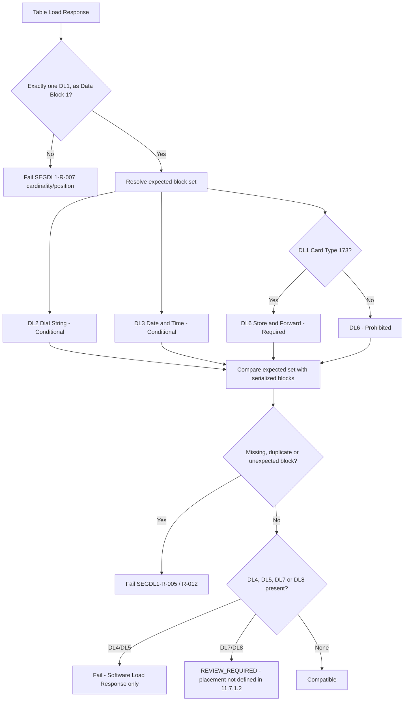

# Segment DL1 Companion-Segment Compatibility Decision Flow

```mermaid
flowchart TD
    A[Table Load Response] --> B{Exactly one DL1, as Data Block 1?}
    B -->|No| X1[Fail SEGDL1-R-007 cardinality/position]
    B -->|Yes| C[Resolve expected block set]
    C --> D[DL2 Dial String - Conditional]
    C --> E[DL3 Date and Time - Conditional]
    C --> F{DL1 Card Type 173?}
    F -->|Yes| G[DL6 Store and Forward - Required]
    F -->|No| H[DL6 - Prohibited]
    D --> I[Compare expected set with serialized blocks]
    E --> I
    G --> I
    H --> I
    I --> J{Missing, duplicate or unexpected block?}
    J -->|Yes| X2[Fail SEGDL1-R-005 / R-012]
    J -->|No| K{DL4, DL5, DL7 or DL8 present?}
    K -->|DL4/DL5| X3[Fail - Software Load Response only]
    K -->|DL7/DL8| R1[REVIEW_REQUIRED - placement not defined in 11.7.1.2]
    K -->|None| OK[Compatible]
```

Unlike Segment 100 there is no Element 63 segment count: the Table Load Response is parsed by Data Type Indicator per block.
