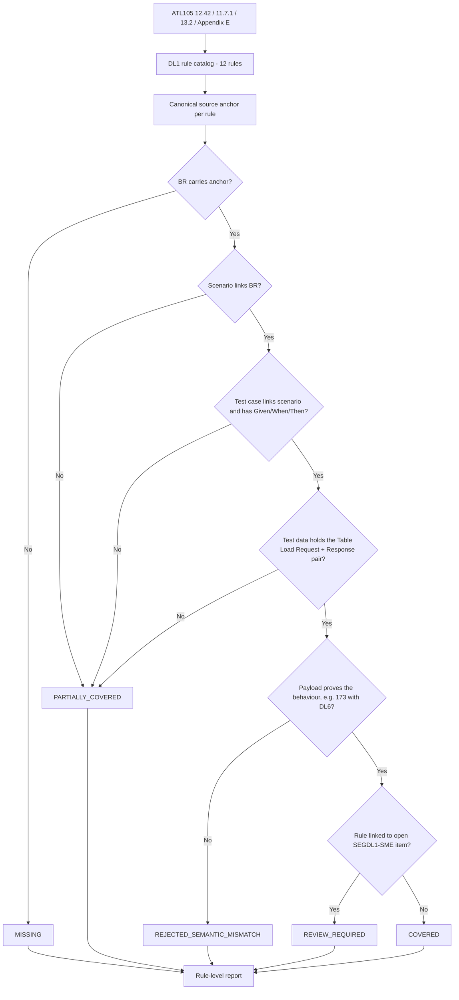

# Segment DL1 Coverage Closure Flow

Rules currently `REVIEW_REQUIRED` by design: `SEGDL1-R-003` and `R-006` (P-02), `R-005` and `R-012` (P-03), and `R-009` (P-04). The provisional [coverage package](../../../../../test-output/test-json/segment-DL1-coverage-package.json) maps 12 scenarios, 27 test cases, and 27 symbolic request/response pairs; they are unapproved and unexecuted, so no rule is certified `COVERED`.

The [AI artifact coverage report](segment-DL1-ai-artifact-coverage-report.md) compares the available one-chain DL1 AI sample to this 12-rule oracle and independently validates its test data. It distinguishes candidate mappings from executed coverage.
