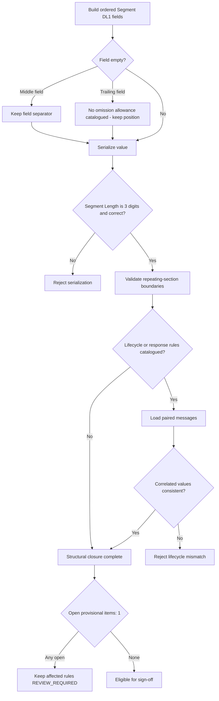

# Segment DL1 Final Closure Flow

```mermaid
flowchart TD
    A[Build ordered Segment DL1 fields] --> B{Field empty?}
    B -->|Middle field| C[Keep field separator]
    B -->|Trailing field| D[No omission allowance catalogued - keep position]
    C --> F
    D --> F
    B -->|No| F[Serialize value]
    F --> G{Segment Length is 3 digits and correct?}
    G -->|No| X1[Reject serialization]
    G -->|Yes| H[Validate repeating-section boundaries]
    H --> I
    I{Lifecycle or response rules catalogued?}
    I -->|No| Z[Structural closure complete]
    I -->|Yes| J[Load paired messages]
    J --> K{Correlated values consistent?}
    K -->|No| X2[Reject lifecycle mismatch]
    K -->|Yes| Z
    Z --> P{Open provisional items: 1}
    P -->|Any open| R[Keep affected rules REVIEW_REQUIRED]
    P -->|None| S[Eligible for sign-off]
```

Serialization rules: 1 · Lifecycle/response rules: 1 · Open provisional items: 1
