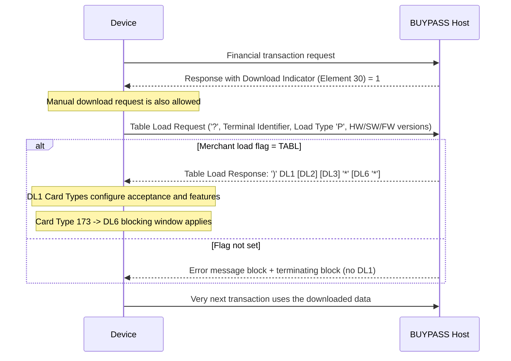

# Segment DL1 Lifecycle, Response and Message Correlation Flow

Rules: `SEGDL1-R-005`, `SEGDL1-R-008`, `SEGDL1-R-012`. Open: `SEGDL1-SME-003` (End-of-Load count when DL6 is sent).

Source: [segment-DL1-rule-catalog.json](coverage/segment-DL1-rule-catalog.json) · Note: [lifecycle-response-correlation-sme-tba-note.md](lifecycle-response-correlation-sme-tba-note.md)
