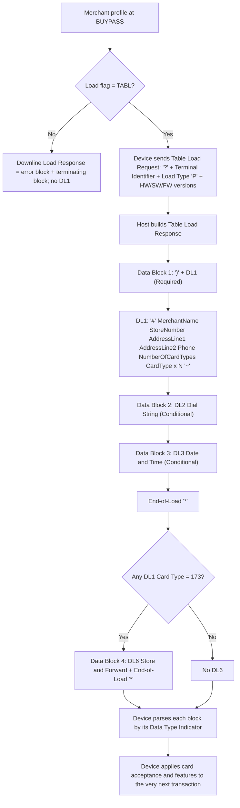
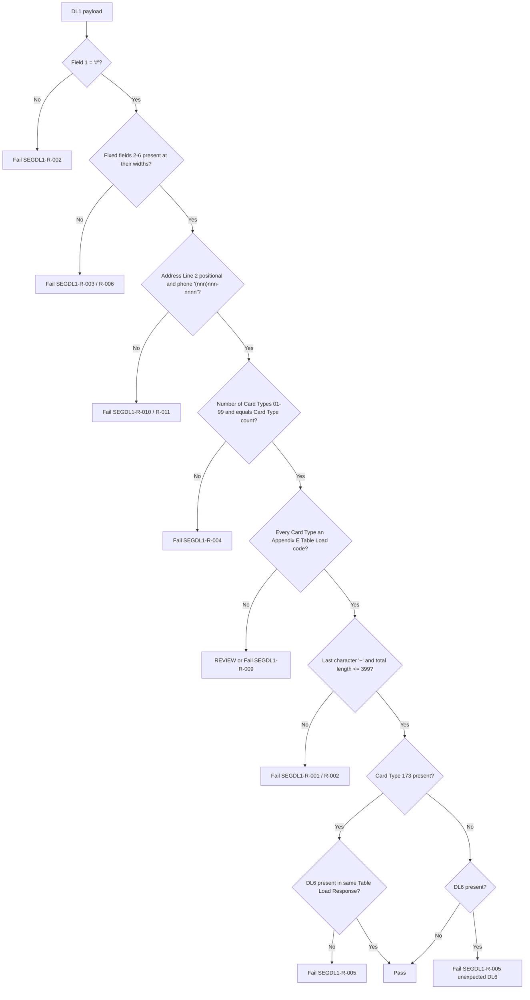

# Segment DL1 End-to-End Flow

TCP/IP: the Start-of-Data Block Indicator `)` is sent only before Data Block No. 1. Whether `*` appears both after DL3 and after DL6 is open (`SEGDL1-SME-003`).

## Validator Decision Flow (`SegmentDL1PayloadValidator`, planned)

