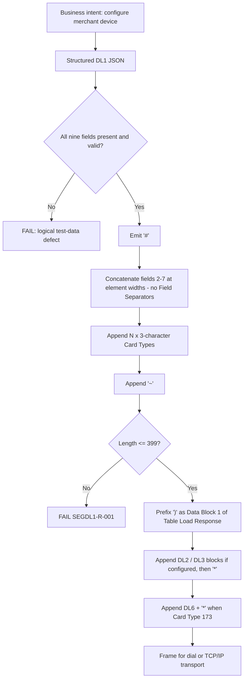

# Segment DL1 Serialization and Wire-Format Flow



## Layered Decision

```text
Merchant profile -> logical DL1 JSON -> serialized DL1 -> Table Load Response -> transport frame
```

Synthetic example (assuming full-width padding, `SEGDL1-SME-002`), 111 characters:

```text
#SAMPLE MERCHANT STORE   0000000000001234100 TEST STREET         SPRINGFIELD  IL 62701(555)555-010003020011173~
```
