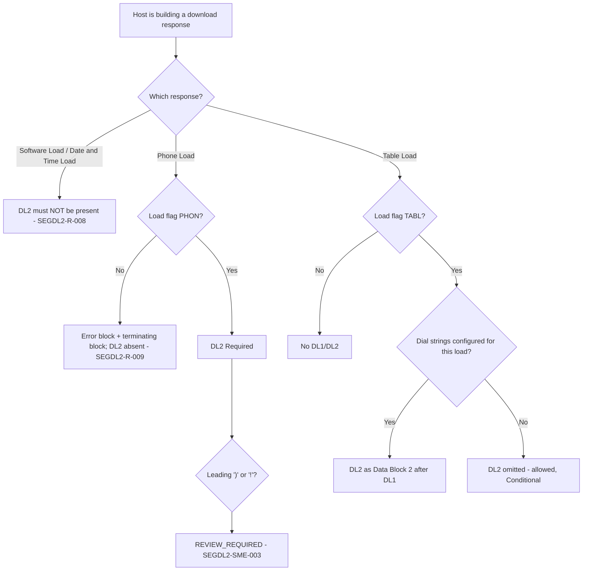

# Segment DL2 Applicability and Message-Family Decision Flow

| Message | DL2 | Evidence |
|---|---|---|
| Table Load Response | **C**, Data Block 2 | 11.7.1.2 field 4 |
| Phone Load Response | **R**, only segment | 11.7.2.2 field 2 |
| Date and Time / Software Load Response | Not allowed | 11.7.3.2, 11.7.4.2 layouts |
| Any request | Not allowed | DL2 originates at BUYPASS |

Source: [segment-DL2-rule-catalog.json](coverage/segment-DL2-rule-catalog.json) · Note: [applicability-decision-sme-tba-note.md](applicability-decision-sme-tba-note.md)
