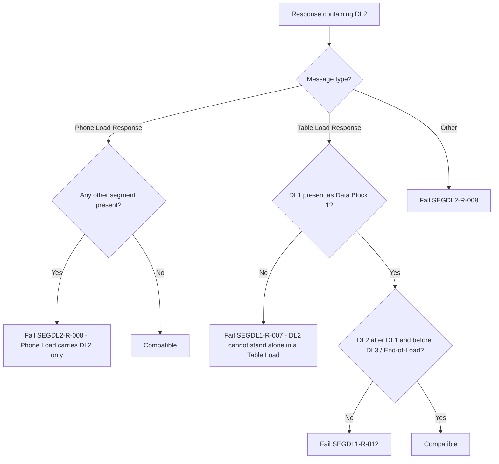

# Segment DL2 Companion-Segment Compatibility Decision Flow

```mermaid
flowchart TD
    A[Response containing DL2] --> B{Message type?}
    B -->|Phone Load Response| C{Any other segment present?}
    C -->|Yes| X1[Fail SEGDL2-R-008 - Phone Load carries DL2 only]
    C -->|No| OK1[Compatible]
    B -->|Table Load Response| D{DL1 present as Data Block 1?}
    D -->|No| X2[Fail SEGDL1-R-007 - DL2 cannot stand alone in a Table Load]
    D -->|Yes| E{DL2 after DL1 and before DL3 / End-of-Load?}
    E -->|No| X3[Fail SEGDL1-R-012]
    E -->|Yes| OK2[Compatible]
    B -->|Other| X4[Fail SEGDL2-R-008]
```
