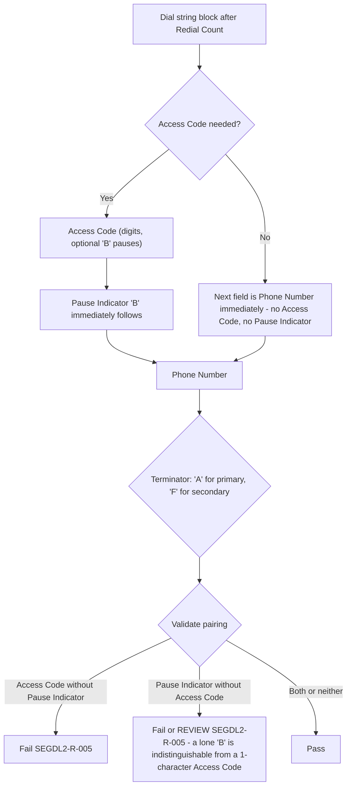

# Segment DL2 Conditional Fields and Cross-Field Dependencies Flow

The same decision is made independently for the primary (fields 4-5) and the secondary (fields 9-10) block.

Source: [segment-DL2-rule-catalog.json](coverage/segment-DL2-rule-catalog.json) · Note: [conditional-dependency-rules-sme-tba-note.md](conditional-dependency-rules-sme-tba-note.md)
