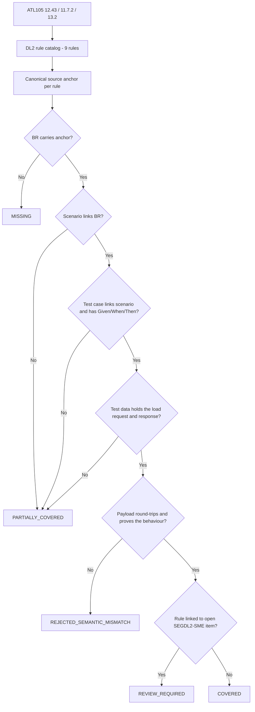

# Segment DL2 Coverage Closure Flow

Rules currently `REVIEW_REQUIRED` by design: `SEGDL2-R-003` (P-01), `R-008` (P-03), `R-004`, `R-005`, `R-007` (P-04).

The provisional [coverage package](../../../../../test-output/test-json/segment-DL2-coverage-package.json) maps all 9 rules to scenarios and 29 symbolic request/response candidates. The [AI coverage report](segment-DL2-ai-artifact-coverage-report.md) separately inventories the supplied AI catalog's 16 DL2 requirements and the one-chain phase-one sample; catalog links are candidate source-element mappings, not semantic equivalence. Candidates are unapproved and unexecuted; no rule is certified `COVERED`.
