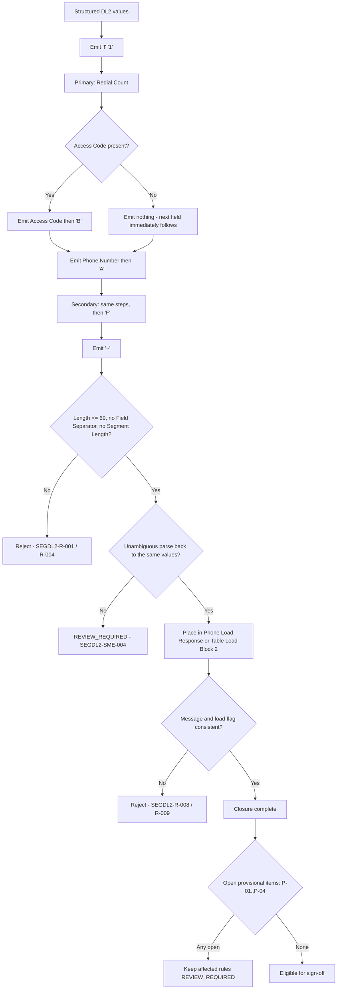

# Segment DL2 Final Closure Flow

```mermaid
flowchart TD
    A[Structured DL2 values] --> B["Emit '!' '1'"]
    B --> C[Primary: Redial Count]
    C --> D{Access Code present?}
    D -->|Yes| E["Emit Access Code then 'B'"]
    D -->|No| F[Emit nothing - next field immediately follows]
    E --> G["Emit Phone Number then 'A'"]
    F --> G
    G --> H[Secondary: same steps, then 'F']
    H --> I["Emit '~'"]
    I --> J{Length <= 69, no Field Separator, no Segment Length?}
    J -->|No| X1[Reject - SEGDL2-R-001 / R-004]
    J -->|Yes| K{Unambiguous parse back to the same values?}
    K -->|No| R1[REVIEW_REQUIRED - SEGDL2-SME-004]
    K -->|Yes| L[Place in Phone Load Response or Table Load Block 2]
    L --> M{Message and load flag consistent?}
    M -->|No| X2[Reject - SEGDL2-R-008 / R-009]
    M -->|Yes| Z[Closure complete]
    Z --> P{Open provisional items: P-01..P-04}
    P -->|Any open| R[Keep affected rules REVIEW_REQUIRED]
    P -->|None| S[Eligible for sign-off]
```
