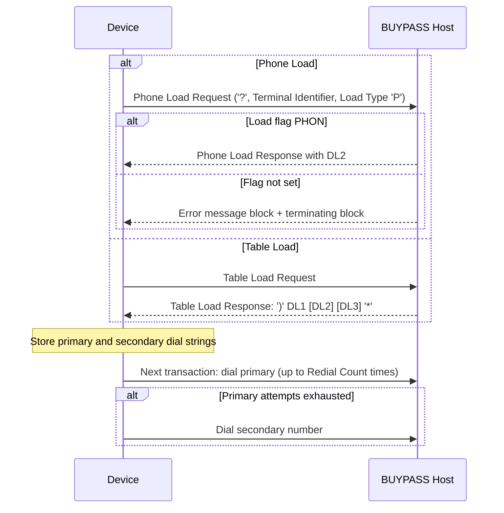

# Segment DL2 Lifecycle, Response and Message Correlation Flow

Rules: `SEGDL2-R-003`, `SEGDL2-R-008`, `SEGDL2-R-009`. Open: `SEGDL2-SME-001` (error-recovery timing), `SEGDL2-SME-003` (Phone Load framing).

Source: [segment-DL2-rule-catalog.json](coverage/segment-DL2-rule-catalog.json) · Note: [lifecycle-response-correlation-sme-tba-note.md](lifecycle-response-correlation-sme-tba-note.md)
