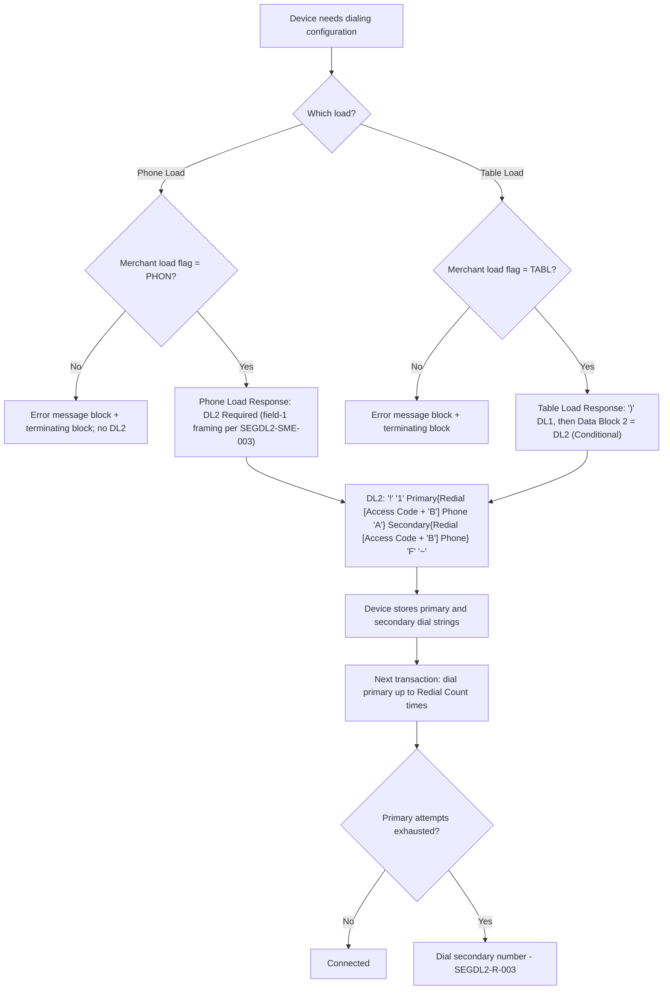
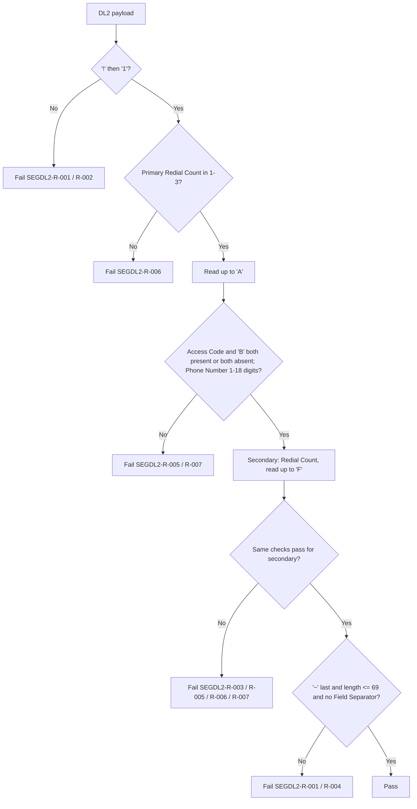

# Segment DL2 End-to-End Flow

```mermaid
flowchart TD
    A[Device needs dialing configuration] --> B{Which load?}
    B -->|Phone Load| C{Merchant load flag = PHON?}
    C -->|No| E1[Error message block + terminating block; no DL2]
    C -->|Yes| D["Phone Load Response: DL2 Required (field-1 framing per SEGDL2-SME-003)"]
    B -->|Table Load| F{Merchant load flag = TABL?}
    F -->|No| E2[Error message block + terminating block]
    F -->|Yes| G["Table Load Response: ')' DL1, then Data Block 2 = DL2 (Conditional)"]
    D --> H["DL2: '!' '1' Primary{Redial [Access Code + 'B'] Phone 'A'} Secondary{Redial [Access Code + 'B'] Phone} 'F' '~'"]
    G --> H
    H --> I[Device stores primary and secondary dial strings]
    I --> J[Next transaction: dial primary up to Redial Count times]
    J --> K{Primary attempts exhausted?}
    K -->|No| L[Connected]
    K -->|Yes| M[Dial secondary number - SEGDL2-R-003]
```

## Validator Decision Flow (`SegmentDL2PayloadValidator`, planned)

```mermaid
flowchart TD
    P[DL2 payload] --> V1{"'!' then '1'?"}
    V1 -->|No| X1[Fail SEGDL2-R-001 / R-002]
    V1 -->|Yes| V2{Primary Redial Count in 1-3?}
    V2 -->|No| X6[Fail SEGDL2-R-006]
    V2 -->|Yes| V3[Read up to 'A']
    V3 --> V4{Access Code and 'B' both present or both absent; Phone Number 1-18 digits?}
    V4 -->|No| X5[Fail SEGDL2-R-005 / R-007]
    V4 -->|Yes| V5[Secondary: Redial Count, read up to 'F']
    V5 --> V6{Same checks pass for secondary?}
    V6 -->|No| X3[Fail SEGDL2-R-003 / R-005 / R-006 / R-007]
    V6 -->|Yes| V7{"'~' last and length <= 69 and no Field Separator?"}
    V7 -->|No| X4[Fail SEGDL2-R-001 / R-004]
    V7 -->|Yes| OK[Pass]
```
