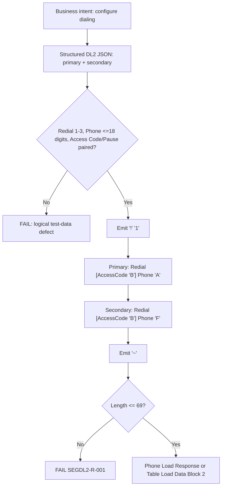

# Segment DL2 Serialization and Wire-Format Flow



Synthetic example, 29 characters (primary with access code `9`, secondary without):

```text
!139B5555550100A25555550199F~
```

Maximum-width shape, 69 characters: `!` `1` + (1 + 12 + 1 + 18 + `A`) + (1 + 12 + 1 + 18 + `F`) + `~`.
