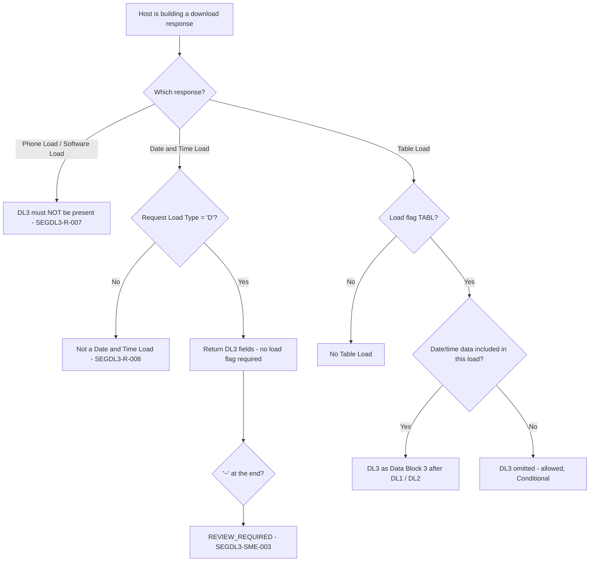

# Segment DL3 Applicability and Message-Family Decision Flow

| Message | DL3 | Evidence |
|---|---|---|
| Table Load Response | **C**, Data Block 3 | 11.7.1.2 field 6 |
| Date and Time Load Response | Its fields form the response | 11.7.3.2; Chapter 12 matrix |
| Phone / Software Load Response | Not allowed | 11.7.2.2, 11.7.4.2 |

Source: [segment-DL3-rule-catalog.json](coverage/segment-DL3-rule-catalog.json) · Note: [applicability-decision-sme-tba-note.md](applicability-decision-sme-tba-note.md)
