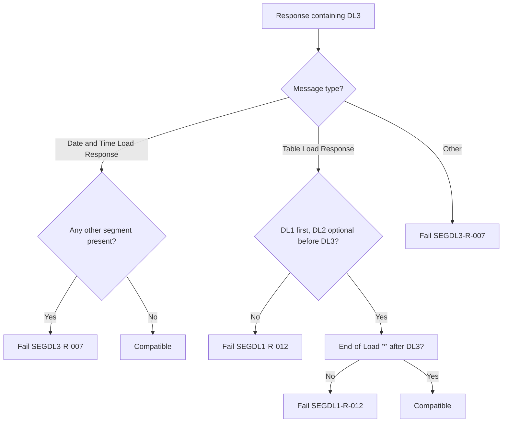

# Segment DL3 Companion-Segment Compatibility Decision Flow

```mermaid
flowchart TD
    A[Response containing DL3] --> B{Message type?}
    B -->|Date and Time Load Response| C{Any other segment present?}
    C -->|Yes| X1[Fail SEGDL3-R-007]
    C -->|No| OK1[Compatible]
    B -->|Table Load Response| D{DL1 first, DL2 optional before DL3?}
    D -->|No| X2[Fail SEGDL1-R-012]
    D -->|Yes| E["End-of-Load '*' after DL3?"]
    E -->|No| X3[Fail SEGDL1-R-012]
    E -->|Yes| OK2[Compatible]
    B -->|Other| X4[Fail SEGDL3-R-007]
```
