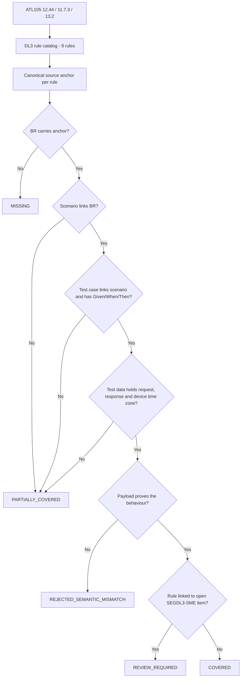

# Segment DL3 Coverage Closure Flow

Rules currently `REVIEW_REQUIRED` by design: `SEGDL3-R-003`, `R-006` (P-02), `R-001`, `R-007` (P-03), `R-005` (P-04), and review-severity `R-009` pending device-level evidence.

The independent candidate package maps all 9 rules to canonical BRs and scenarios, and defines 18 candidate test cases with linked symbolic request/response records. It is not an AI-produced test package, is not SME-approved, and has not been executed. See the [coverage report](segment-DL3-ai-artifact-coverage-report.md) for the separate 12-requirement supplied AI catalog, the one-chain phase-one sample, and open validation results.
