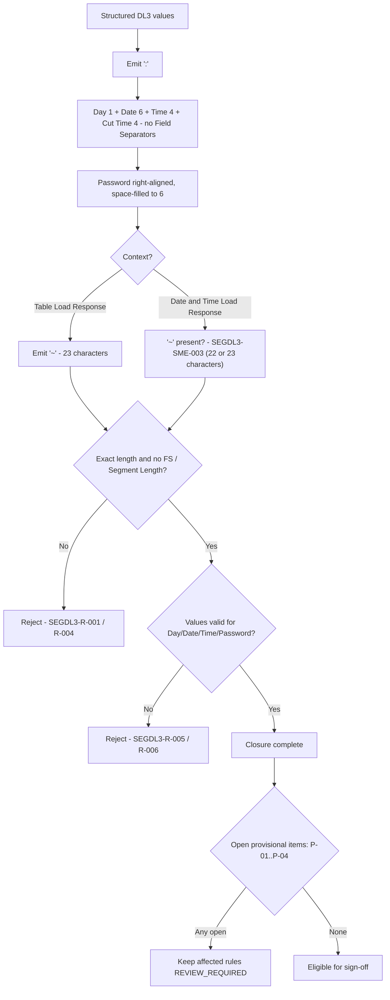

# Segment DL3 Final Closure Flow

```mermaid
flowchart TD
    A[Structured DL3 values] --> B["Emit ':'"]
    B --> C[Day 1 + Date 6 + Time 4 + Cut Time 4 - no Field Separators]
    C --> D[Password right-aligned, space-filled to 6]
    D --> E{Context?}
    E -->|Table Load Response| F["Emit '~' - 23 characters"]
    E -->|Date and Time Load Response| G["'~' present? - SEGDL3-SME-003 (22 or 23 characters)"]
    F --> H{Exact length and no FS / Segment Length?}
    G --> H
    H -->|No| X1[Reject - SEGDL3-R-001 / R-004]
    H -->|Yes| I{Values valid for Day/Date/Time/Password?}
    I -->|No| X2[Reject - SEGDL3-R-005 / R-006]
    I -->|Yes| Z[Closure complete]
    Z --> P{Open provisional items: P-01..P-04}
    P -->|Any open| R[Keep affected rules REVIEW_REQUIRED]
    P -->|None| S[Eligible for sign-off]
```
