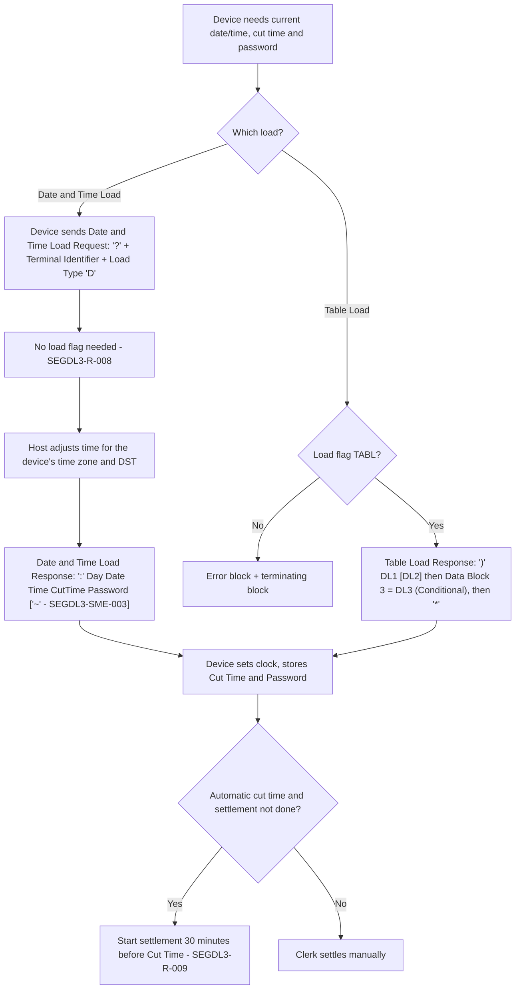
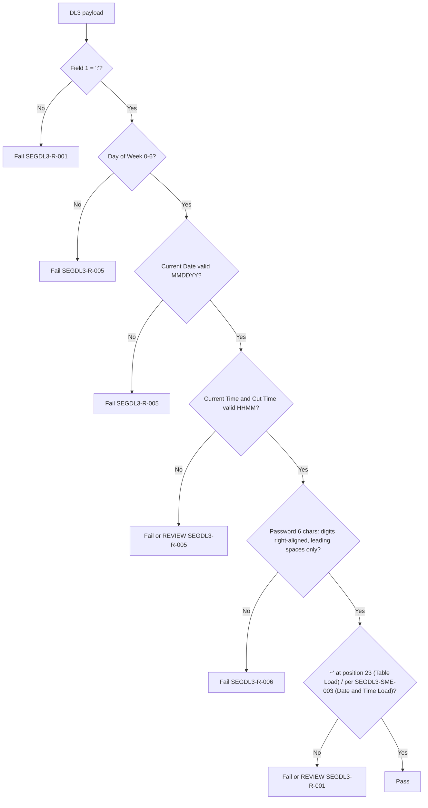

# Segment DL3 End-to-End Flow

```mermaid
flowchart TD
    A[Device needs current date/time, cut time and password] --> B{Which load?}
    B -->|Date and Time Load| C["Device sends Date and Time Load Request: '?' + Terminal Identifier + Load Type 'D'"]
    C --> D[No load flag needed - SEGDL3-R-008]
    D --> E[Host adjusts time for the device's time zone and DST]
    E --> F["Date and Time Load Response: ':' Day Date Time CutTime Password ['~' - SEGDL3-SME-003]"]
    B -->|Table Load| G{Load flag TABL?}
    G -->|No| N1[Error block + terminating block]
    G -->|Yes| H["Table Load Response: ')' DL1 [DL2] then Data Block 3 = DL3 (Conditional), then '*'"]
    F --> I[Device sets clock, stores Cut Time and Password]
    H --> I
    I --> J{Automatic cut time and settlement not done?}
    J -->|Yes| K[Start settlement 30 minutes before Cut Time - SEGDL3-R-009]
    J -->|No| L[Clerk settles manually]
```

## Validator Decision Flow (`SegmentDL3PayloadValidator`, planned)

```mermaid
flowchart TD
    P[DL3 payload] --> V1{"Field 1 = ':'?"}
    V1 -->|No| X1[Fail SEGDL3-R-001]
    V1 -->|Yes| V2{Day of Week 0-6?}
    V2 -->|No| X5a[Fail SEGDL3-R-005]
    V2 -->|Yes| V3{Current Date valid MMDDYY?}
    V3 -->|No| X5b[Fail SEGDL3-R-005]
    V3 -->|Yes| V4{Current Time and Cut Time valid HHMM?}
    V4 -->|No| X5c[Fail or REVIEW SEGDL3-R-005]
    V4 -->|Yes| V5{Password 6 chars: digits right-aligned, leading spaces only?}
    V5 -->|No| X6[Fail SEGDL3-R-006]
    V5 -->|Yes| V6{"'~' at position 23 (Table Load) / per SEGDL3-SME-003 (Date and Time Load)?"}
    V6 -->|No| X1b[Fail or REVIEW SEGDL3-R-001]
    V6 -->|Yes| OK[Pass]
```
