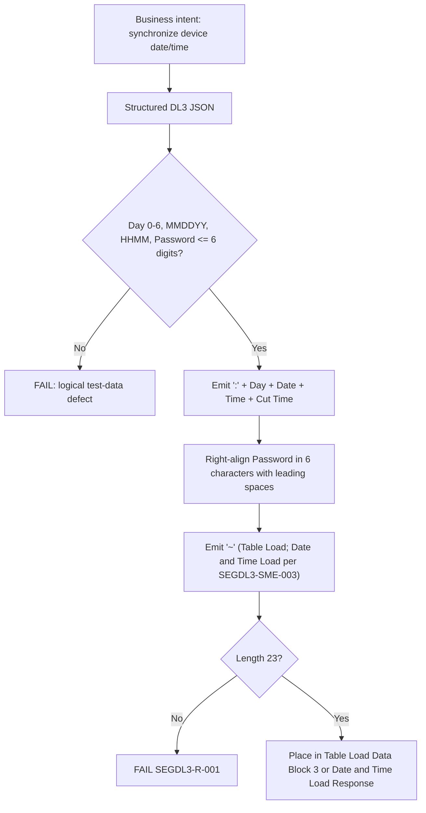

# Segment DL3 Serialization and Wire-Format Flow


```mermaid
flowchart TD
    A[Business intent: synchronize device date/time] --> B[Structured DL3 JSON]
    B --> C{Day 0-6, MMDDYY, HHMM, Password <= 6 digits?}
    C -->|No| X1[FAIL: logical test-data defect]
    C -->|Yes| D["Emit ':' + Day + Date + Time + Cut Time"]
    D --> E[Right-align Password in 6 characters with leading spaces]
    E --> F["Emit '~' (Table Load; Date and Time Load per SEGDL3-SME-003)"]
    F --> G{Length 23?}
    G -->|No| X2[FAIL SEGDL3-R-001]
    G -->|Yes| H[Place in Table Load Data Block 3 or Date and Time Load Response]
```

Synthetic example (Wednesday 30 Sep 2026, 14:05, cut time 23:00, password 4821), 23 characters:

```text
:309302614052300  4821~
```
