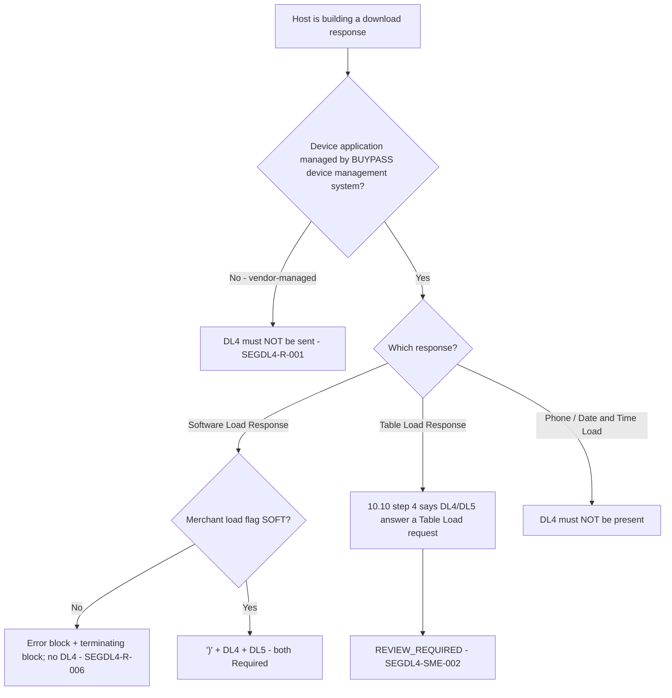

# Segment DL4 Applicability and Message-Family Decision Flow

| Message | DL4 | Evidence |
|---|---|---|
| Software Load Response | **R**, with DL5 | 11.7.4.2 field 2; Chapter 12 matrix |
| Table Load Response | Conflict | 10.10 step 4 vs 11.7.1.2 layout (no DL4) |
| Phone / Date and Time Load Response | Not allowed | 11.7.2.2, 11.7.3.2 |

Source: [segment-DL4-rule-catalog.json](coverage/segment-DL4-rule-catalog.json) · Note: [applicability-decision-sme-tba-note.md](applicability-decision-sme-tba-note.md)
