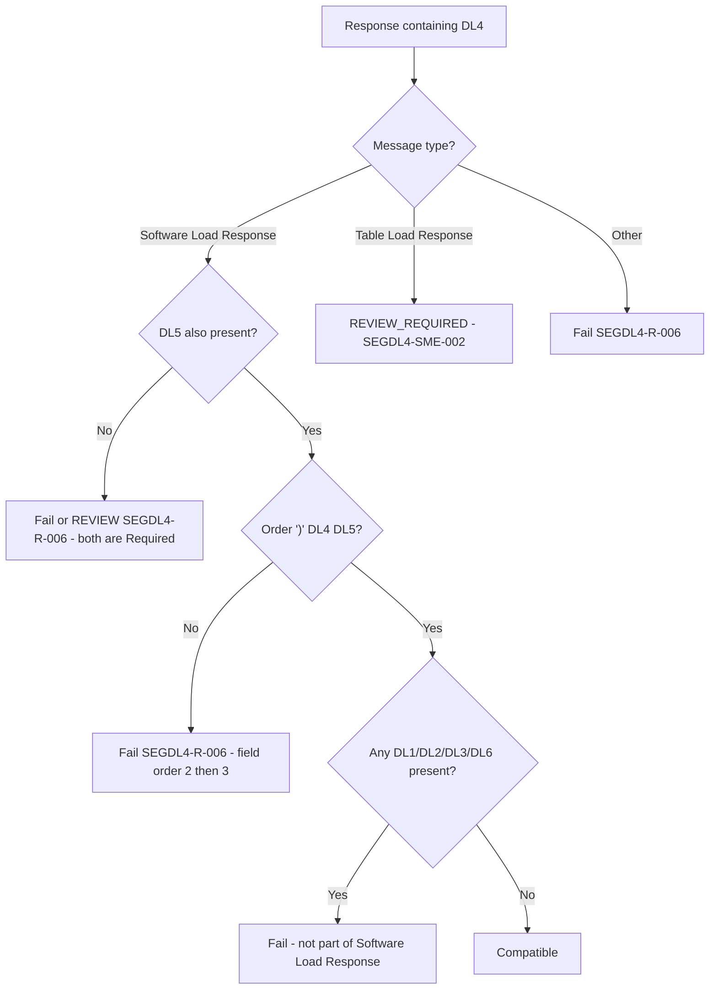

# Segment DL4 Companion-Segment Compatibility Decision Flow

```mermaid
flowchart TD
    A[Response containing DL4] --> B{Message type?}
    B -->|Software Load Response| C{DL5 also present?}
    C -->|No| X1[Fail or REVIEW SEGDL4-R-006 - both are Required]
    C -->|Yes| D{"Order ')' DL4 DL5?"}
    D -->|No| X2[Fail SEGDL4-R-006 - field order 2 then 3]
    D -->|Yes| E{Any DL1/DL2/DL3/DL6 present?}
    E -->|Yes| X3[Fail - not part of Software Load Response]
    E -->|No| OK[Compatible]
    B -->|Table Load Response| R1[REVIEW_REQUIRED - SEGDL4-SME-002]
    B -->|Other| X4[Fail SEGDL4-R-006]
```

The earlier flow ("dial delivery XOR IP delivery") had no source and is withdrawn.
