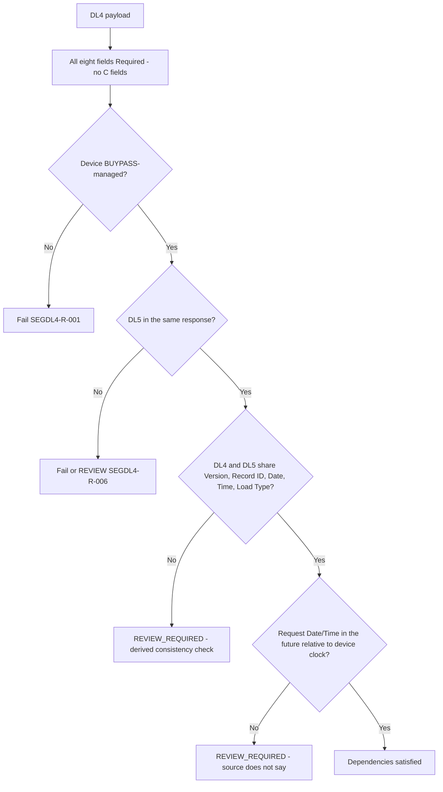

# Segment DL4 Conditional Fields and Cross-Field Dependencies Flow

Source: [segment-DL4-rule-catalog.json](coverage/segment-DL4-rule-catalog.json) · Note: [conditional-dependency-rules-sme-tba-note.md](conditional-dependency-rules-sme-tba-note.md)
