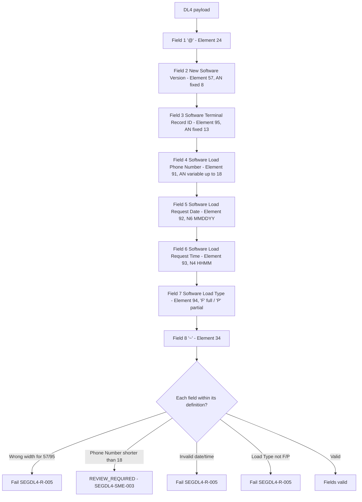

# Segment DL4 Field Definitions and Element Semantics Flow

Source: [segment-DL4-rule-catalog.json](coverage/segment-DL4-rule-catalog.json) · Note: [field-definitions-sme-tba-note.md](field-definitions-sme-tba-note.md)
