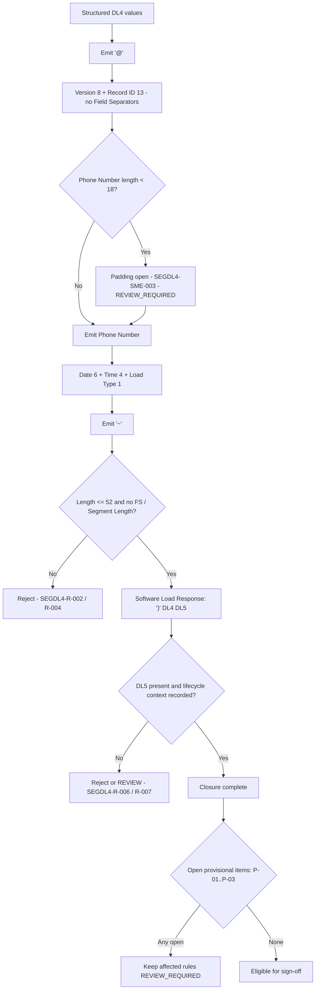

# Segment DL4 Final Closure Flow

```mermaid
flowchart TD
    A[Structured DL4 values] --> B["Emit '@'"]
    B --> C[Version 8 + Record ID 13 - no Field Separators]
    C --> D{Phone Number length < 18?}
    D -->|Yes| R1[Padding open - SEGDL4-SME-003 - REVIEW_REQUIRED]
    D -->|No| E[Emit Phone Number]
    R1 --> E
    E --> F[Date 6 + Time 4 + Load Type 1]
    F --> G["Emit '~'"]
    G --> H{Length <= 52 and no FS / Segment Length?}
    H -->|No| X1[Reject - SEGDL4-R-002 / R-004]
    H -->|Yes| I["Software Load Response: ')' DL4 DL5"]
    I --> J{DL5 present and lifecycle context recorded?}
    J -->|No| X2[Reject or REVIEW - SEGDL4-R-006 / R-007]
    J -->|Yes| Z[Closure complete]
    Z --> P{Open provisional items: P-01..P-03}
    P -->|Any open| R[Keep affected rules REVIEW_REQUIRED]
    P -->|None| S[Eligible for sign-off]
```
