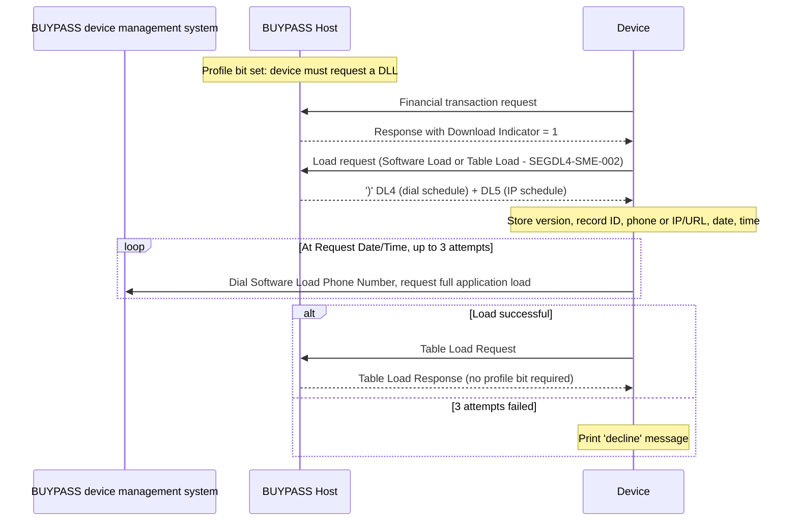

# Segment DL4 Lifecycle, Response and Message Correlation Flow

Rules: `SEGDL4-R-006`, `SEGDL4-R-007`, `SEGDL4-R-008`.

Source: [segment-DL4-rule-catalog.json](coverage/segment-DL4-rule-catalog.json) · Note: [lifecycle-response-correlation-sme-tba-note.md](lifecycle-response-correlation-sme-tba-note.md)
