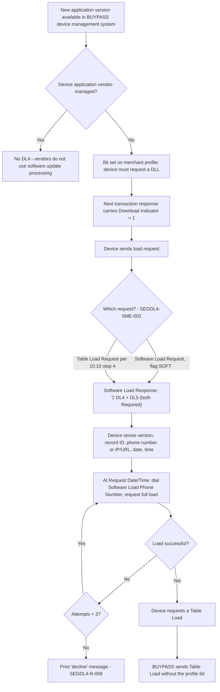
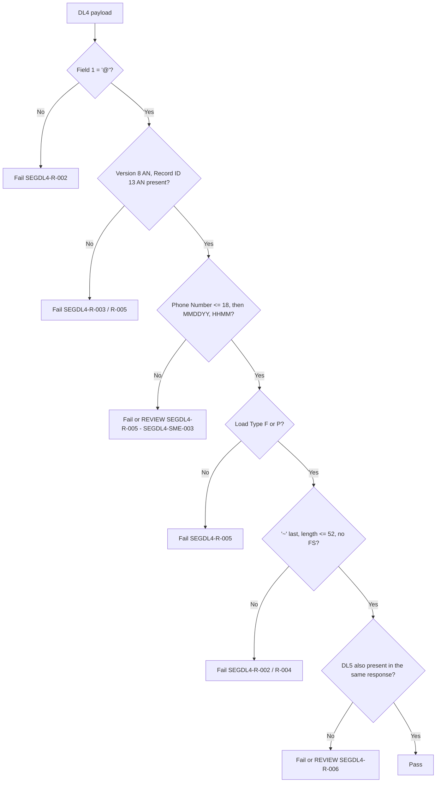

# Segment DL4 End-to-End Flow

```mermaid
flowchart TD
    A[New application version available in BUYPASS device management system] --> B{Device application vendor-managed?}
    B -->|Yes| N1[No DL4 - vendors do not use software update processing]
    B -->|No| C[Bit set on merchant profile: device must request a DLL]
    C --> D[Next transaction response carries Download Indicator = 1]
    D --> E[Device sends load request]
    E --> F{Which request? - SEGDL4-SME-002}
    F -->|Software Load Request, flag SOFT| G["Software Load Response: ')' DL4 + DL5 (both Required)"]
    F -->|Table Load Request per 10.10 step 4| G
    G --> H[Device stores version, record ID, phone number or IP/URL, date, time]
    H --> I[At Request Date/Time: dial Software Load Phone Number, request full load]
    I --> J{Load successful?}
    J -->|No| K{Attempts < 3?}
    K -->|Yes| I
    K -->|No| L[Print 'decline' message - SEGDL4-R-008]
    J -->|Yes| M[Device requests a Table Load]
    M --> N[BUYPASS sends Table Load without the profile bit]
```

## Validator Decision Flow (`SegmentDL4PayloadValidator`, planned)

```mermaid
flowchart TD
    P[DL4 payload] --> V1{"Field 1 = '@'?"}
    V1 -->|No| X2[Fail SEGDL4-R-002]
    V1 -->|Yes| V2{Version 8 AN, Record ID 13 AN present?}
    V2 -->|No| X3[Fail SEGDL4-R-003 / R-005]
    V2 -->|Yes| V3{Phone Number <= 18, then MMDDYY, HHMM?}
    V3 -->|No| X5[Fail or REVIEW SEGDL4-R-005 - SEGDL4-SME-003]
    V3 -->|Yes| V4{Load Type F or P?}
    V4 -->|No| X5b[Fail SEGDL4-R-005]
    V4 -->|Yes| V5{"'~' last, length <= 52, no FS?"}
    V5 -->|No| X2b[Fail SEGDL4-R-002 / R-004]
    V5 -->|Yes| V6{DL5 also present in the same response?}
    V6 -->|No| X6[Fail or REVIEW SEGDL4-R-006]
    V6 -->|Yes| OK[Pass]
```
