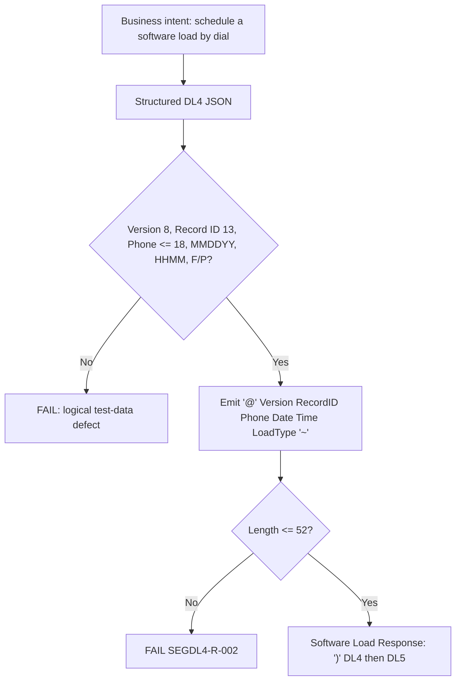

# Segment DL4 Serialization and Wire-Format Flow



Synthetic example, 52 characters (phone number space-padded to 18 — padding assumed, `SEGDL4-SME-003`):

```text
@APP02.10STR00000001235555550142        1015260200F~
```
