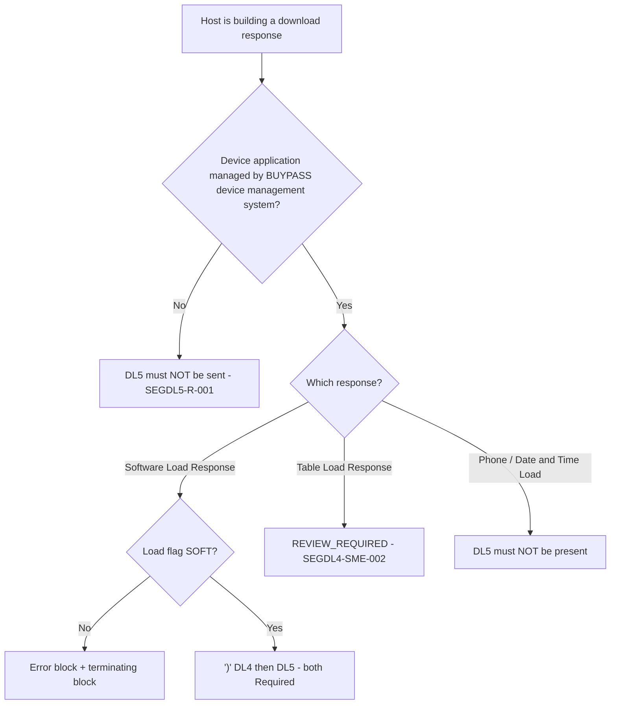

# Segment DL5 Applicability and Message-Family Decision Flow

| Message | DL5 | Evidence |
|---|---|---|
| Software Load Response | **R**, field 3 after DL4 | 11.7.4.2; Chapter 12 matrix |
| Table Load Response | Conflict | 10.10 step 4 (`SEGDL4-SME-002`) |
| Others | Not allowed | 11.7.1.2, 11.7.2.2, 11.7.3.2 |

Source: [segment-DL5-rule-catalog.json](coverage/segment-DL5-rule-catalog.json) · Note: [applicability-decision-sme-tba-note.md](applicability-decision-sme-tba-note.md)
